<!-- Banner -->

  

---

## 🚀 Tech Stack & Tools

### 🖥️ Languages

  
  
  
  
  
  
  
  
  
  
  

### 🎮 Game Development

  
  

### 🛠️ Tools & Editors

  
  
  
  
  
  
  
  

### 🌐 Web & Frameworks

  
  
  
  

---

## 📊 GitHub Stats

  
  

  

# 📊 My Metrics & Stats

### 🚩 picoCTF Statistics
| Attribute | Value |
| :--- | :--- |
| **World Rank** | N/A |
| **Total Score** | 0 |
| **Challenges Solved** | 29 |

[View picoCTF Profile](https://play.picoctf.org/users/spw)

<!-- plugin:base  -->

<!-- plugin:isocalendar (clean) -->

<!-- plugin:languages (clean) -->

<!-- plugin:leetcode (clean) -->

<!-- plugin:stars (clean) -->

<!-- plugin:achievements (clean) -->

<!-- plugin:lines  -->

<!-- plugin:followup  -->

  

